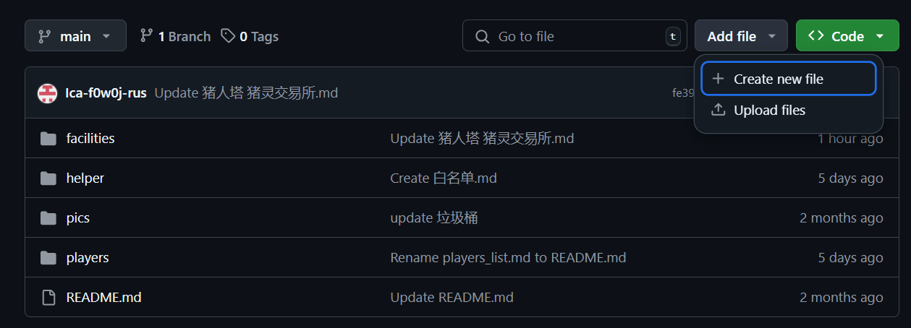
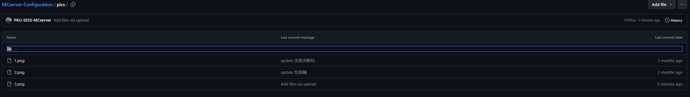

# 在线编辑 github repo

1. 在 repo 的界面右上角点击 "Add file"

2. 选择 create new file
3. 如果想编辑新的文件，只需在上方命名文件，并在相应的界面中排版即可
4. 如果想新建文件夹，只需在新建文件的位置打一个"/"这样就会自动划分出新的文件夹

5. 当添加图片的时候，请统一将图片源存入 `pics` 文件夹
  * 通过 `` 这样的方式将图片插入你自己的 .md 文件中
  * `html` 风格的图片插入也是可以的，例如 ``

